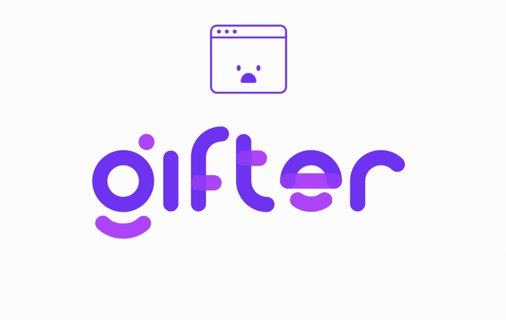

# 🎯 Gifter

Um aplicativo Flutter para buscar e compartilhar GIFs usando a API do Giphy.

## 📱 Funcionalidades

- Visualização de GIFs em tendência
- Busca de GIFs por palavras-chave
- Compartilhamento de GIFs
- Interface adaptativa para diferentes tamanhos de tela
- Suporte a múltiplos idiomas na busca

## 🚀 Tecnologias Utilizadas

- Flutter
- API Giphy
- HTTP para requisições
- Share Plus para compartilhamento
- Path Provider para gerenciamento de arquivos temporários

## 📋 Pré-requisitos

- Flutter SDK
- Dart SDK
- Android Studio / XCode para emuladores
- Uma chave de API do Giphy

## 🔧 Configuração

1. Clone o repositório

```bash
git clone https://github.com/seu-usuario/gifter.git
```

2. Instale as dependências

```bash
flutter pub get
```


3. Configure o arquivo .env na raiz do projeto:

```env
GIPHY_API_KEY=sua_chave_api_aqui
```

## 🔒 Variáveis de Ambiente

O projeto utiliza o arquivo `.env` para gerenciar variáveis sensíveis. Crie uma cópia do arquivo `.env.example` e renomeie para `.env`:

## 📦 Estrutura do Projeto

```
gifter/
├── lib/
│   ├── core/
│   │   └── config/
│   ├── domain/
│   │   ├── entities/
│   │   ├── exceptions/
│   │   └── use_case/
│   ├── infrastructure/
│   │   └── adapters/
│   └── view/
│       └── pages/
└── assets/
```

## 🖥️ Como Executar

```bash
flutter run
```

## 📱 Screenshots

<video width="320" controls>
  <source src="assets/Screen_recording_20241115_153138.mp4" type="video/mp4">
  Seu navegador não suporta o elemento de vídeo.
</video>

## 🤝 Contribuindo

1. Faça um Fork do projeto
2. Crie sua Feature Branch (`git checkout -b feature/AmazingFeature`)
3. Commit suas mudanças (`git commit -m 'Add some AmazingFeature'`)
4. Push para a Branch (`git push origin feature/AmazingFeature`)
5. Abra um Pull Request

## 📄 Licença

Este projeto está sob a licença MIT - veja o arquivo [LICENSE.md](LICENSE.md) para detalhes

